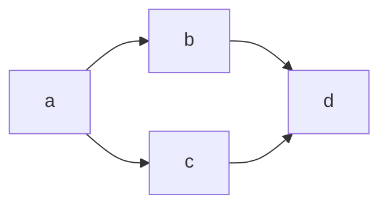

# Zenn 独自の記法

# 見出し 1

## 見出し 2

### 見出し 3

#### 見出し 4

##### 見出し 5

# 太字・斜体・取り消し線

_test_
**Test**
**_Test_**
~~取り消したい文字~~

# 表

| Head | Head | Head |
| ---- | ---- | ---- |
| Text | Text | Text |
| Text | Text | Text |

_キャプション_

# リスト・番号付きリスト

- リスト 1
- リスト 2
- リスト 3

1. リスト 1
2. リスト 2
3. リスト 3

- リスト 1
  - リスト 1-1
  - リスト 1-2
- リスト 2
  - リスト 2-1
  - リスト 2-2

# チェックボックス

- [ ] HTML
- [x] CSS
- [ ] VBA

# リンク

[Google](https://www.google.com)

# 画像


# 動画

https://www.youtube.com/watch?v=WRVsOCh907o

# ツイッター

https://twitter.com/jack/status/20

# メッセージ

:::message
メッセージをここに
:::

:::message alert
警告メッセージをここに
:::

# コード

インラインで`code`を挿入する

```python:pythonサンプル
import pandas as pd

df = pd.read_csv()
```

```diff python:diffサンプル
import pandas as pd

+ df = pd.read_csv()
- df = pd.read_csv("hello.csv")
```

# 数式

$$
e^{i\theta} = \cos\theta + i\sin\theta
$$

# アコーディオン

:::details タイトル
表示したい内容
:::

# リンクカード

https://zenn.dev/zenn/articles/markdown-guide

# マーメイド記法


